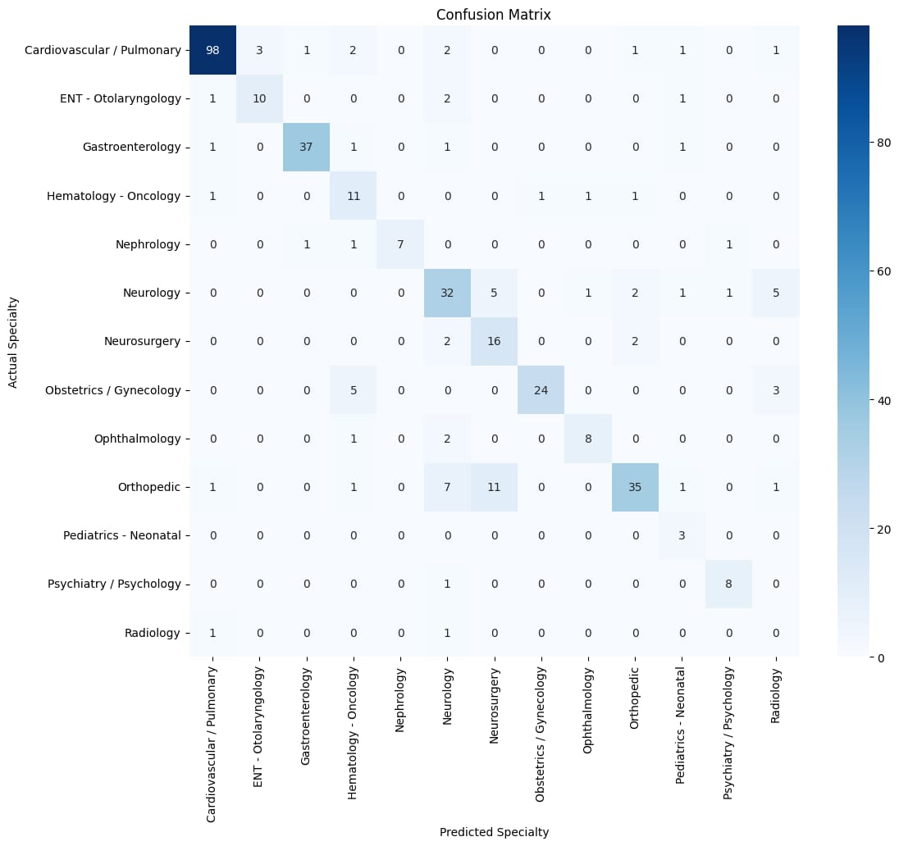
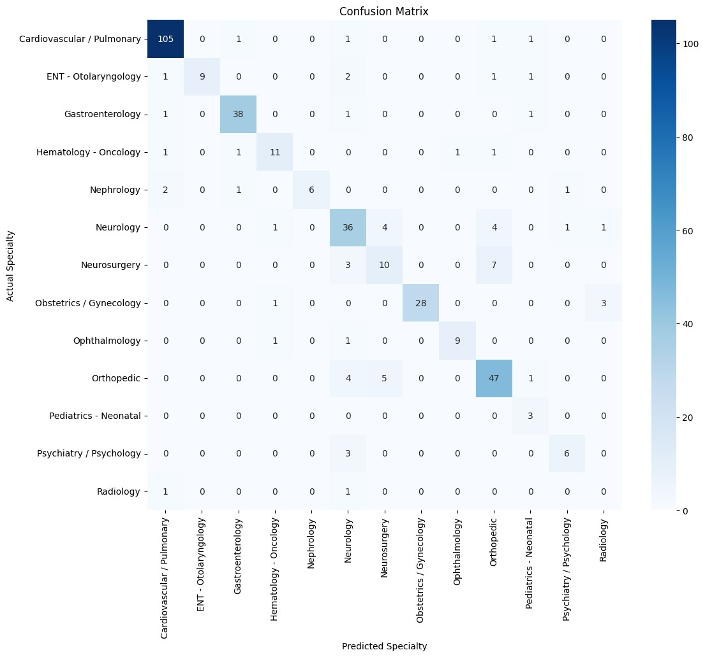

# Medical Specialty Classification AI

**Project Type:** Machine Learning / NLP  
**License:** MIT  
**Repository:** [GitHub Link](https://github.com/Dreaca/ML-Final)  

---

## Project Overview

This project is an AI model designed to classify medical specialties based on transcriptions from a medical database. The goal is to accurately categorize medical cases into their respective specialties, with special attention to rare and often confused cases such as **Orthopedics, Neurology, and Neurosurgery**.  

This model was selected after rigorous testing of three candidate models, ultimately chosen for its superior handling of rare classes and improved overall accuracy.

---

## Project Structure

The codebase is organized into three Jupyter notebooks:

1. **1_eda_and_preprocessing.ipynb** – Exploratory data analysis and preprocessing of transcription data.  
2. **2_classification_modeling.ipynb** – Model training, evaluation, and tuning for optimal performance.  
3. **3_clustering_analysis.ipynb** – Clustering analysis to further understand data patterns and misclassifications.  

Additional resources:  
- **requirements.txt** – Python dependencies for running the notebooks.

---

## Installation

1. Clone the repository:

`git clone https://github.com/Dreaca/ML-Final.git`
`cd ML-Final`

2. Create a virtual environment (optional but recommended):

`python -m venv venv`
`source venv/bin/activate  # Linux/Mac`
`venv\Scripts\activate     # Windows`

3. Install requirements

`pip install -r requirements.txt`

4. Run jupyter notebooks and open notebooks

`jupyter notebook`

## Usage

- Run `1_eda_and_preprocessing.ipynb` to preprocess and clean the transcription data.

- Run `2_classification_modeling.ipynb` to train the AI model and evaluate its performance.

- Run `3_clustering_analysis.ipynb` to analyze clusters and data patterns.

You can adjust preprocessing steps, class weights, and keyword boosts to optimize the model for other datasets if needed.

## Model Performance

The final selected model achieved the following performance metrics:
| Metric    | Macro Average | Weighted Average |
| --------- | ------------- | ---------------- |
| Accuracy  | 0.8324        | -                |
| Precision | 0.75          | 0.85             |
| F1 Score  | 0.72          | 0.84             |
| Recall    | 0.70          | 0.83             |

Key improvements included:

- Combining clean transcription data with relevant keywords.

- Boosting rare specialty keywords.

- Adjusting class weights to reduce misclassification of Orthopedics, Neurology, and Neurosurgery.

Example confusion matrix before improvements:

Example confusion matrix after improvements:

### Contributing

This project is part of an assignment, but future contributors are welcome to:

- Suggest new preprocessing techniques.

- Improve model architecture or feature engineering.

- Add more comprehensive evaluation metrics.

### License

This project is licensed under the MIT License – see the LICENSE
 file for details.

